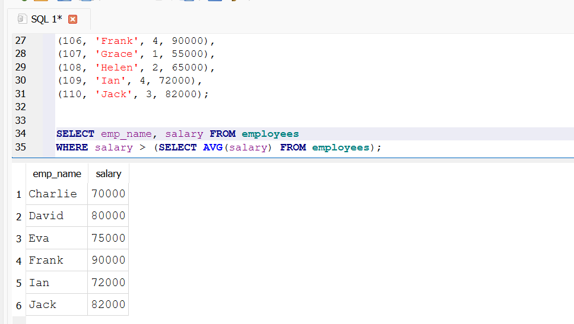
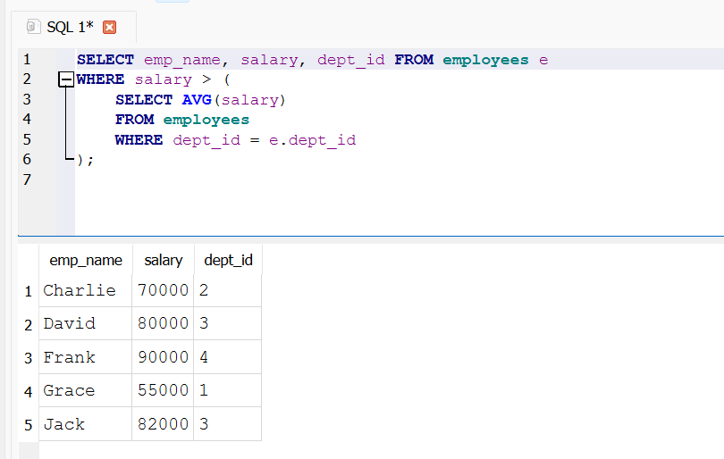
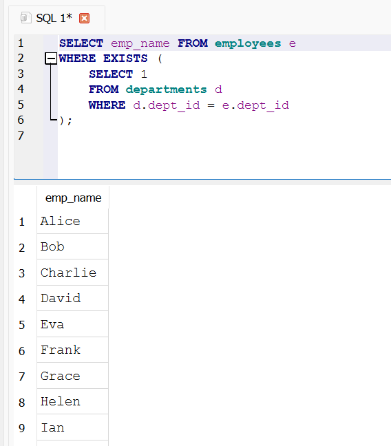
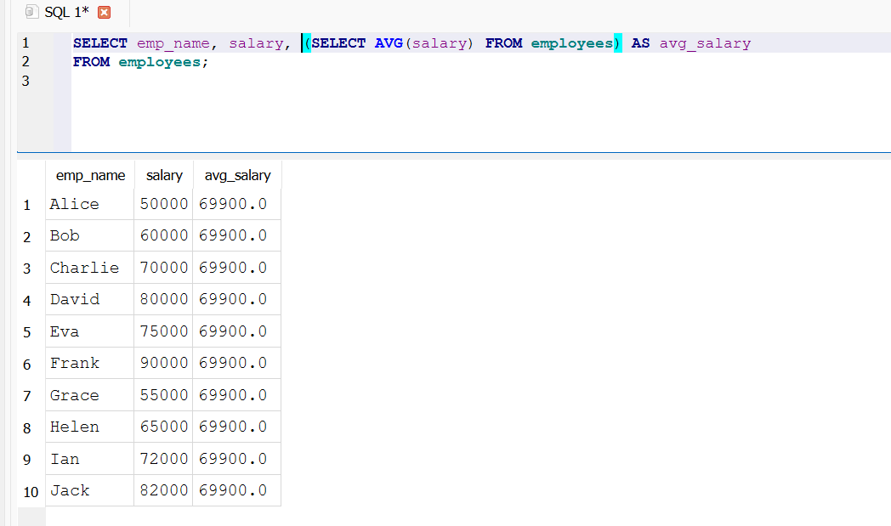
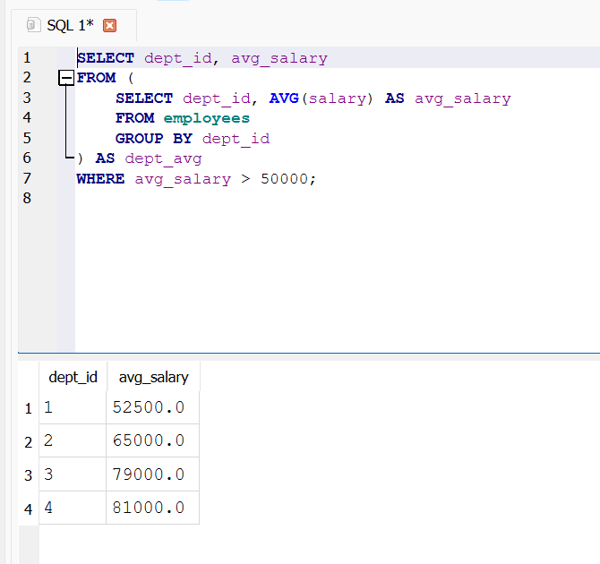
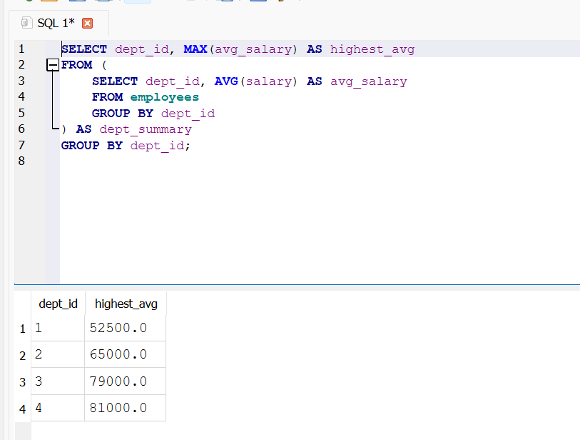

# Task 6 - Subqueries and Nested Queries

## Objective
Practice SQL subqueries in different clauses (SELECT, WHERE, FROM) and understand scalar, correlated, and derived tables.

## 1.What is a subquery?

A subquery is a query inside another SQL query which is used to fetch results that the main query depends on.

## 2.Difference between subquery and join?

A sub query is nested and runs separately and is mainly used for filtering data and join is used to combine rows from multiple tables in one result set.

## 3.What is a correlated subquery?

When a subquery depends upon the outer query for its values and runs per row of the outer query.

## 4.Can subqueries return multiple rows?

Yes subqueries can result in multiple rows.

## 5.How does EXISTS work?

It checks if the subquery returns at least one row.

## 6.How is performance affected by subqueries?

Subqueries are slower because they may run multiple times.

## 7.What is scalar subquery?

A scalar subquery returns a single value.

## 8.Where can we use subqueries?

They are used in select, where, from and having clauses.

## 9.Can a subquery be in FROM clause?

Yes, it is known as derived table.

## 10.What is a derived table?

A derived table is a temporary table created using a subquery in the from clause used like a normal table.

## Screenshots

### 1. Subquery

### 2. Corelated subquery

### 3. Exists

### 4. Scalar subquery

### 5. Subquery in from clause

### 6. Derived table
